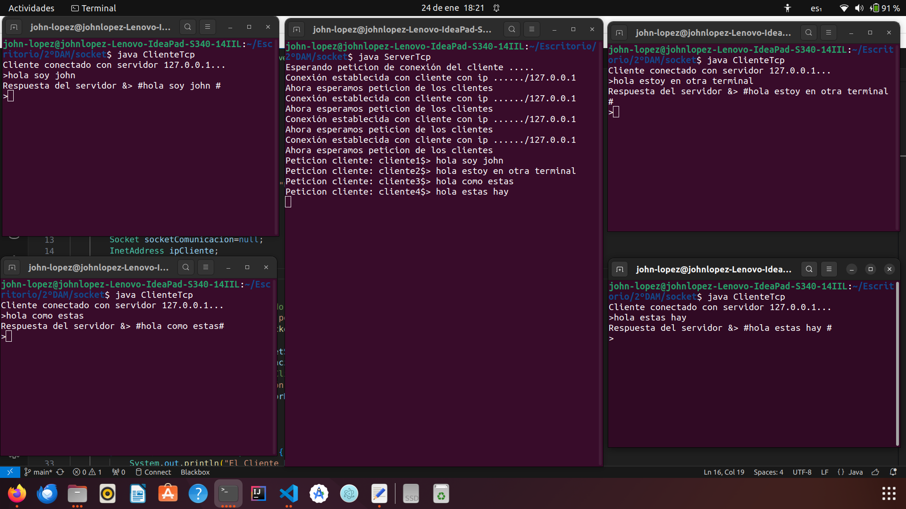

# Actividad en clase.

En esta actividad, se implementará y probará el código de ejemplo de "echo tcp multihilo". 
Se espera realizar pruebas con al menos 4 clientes simultáneamente en el mismo servidor. 
A continuación se presenta la documentación del proceso junto con capturas de pantalla.

## Ejecución con 4 Clientes Simultáneos

Se ejecutaron cuatro instancias del cliente TCP al mismo tiempo, interactuando con el servidor multihilo. A continuación se muestran capturas de pantalla de las ejecuciones:
Secrean cuatro hilos con nombre cliente y un id para diferenciarlos. 
Cliente 1:,Cliente 2:,Cliente 3:,Cliente 4:

Resultados y Observaciones
Durante las pruebas, se observó que el servidor maneja eficientemente múltiples conexiones de clientes simultáneamente, proporcionando respuestas adecuadas a cada solicitud. La implementación multihilo permite una mayor concurrencia y mejora el rendimiento del servidor.

Conclusiones
La actividad fue exitosa al implementar y probar el código de ejemplo de "echo tcp multihilo" con al menos 4 clientes simultáneos. La capacidad de respuesta del servidor multihilo ante múltiples solicitudes demuestra su eficiencia en entornos concurrentes.

